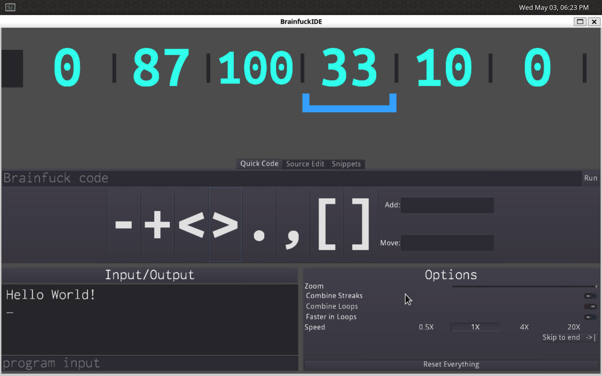
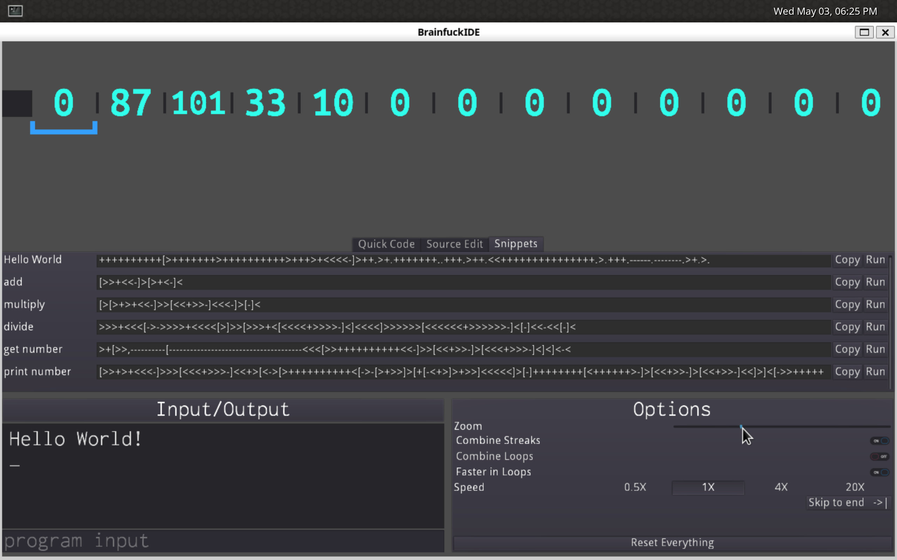
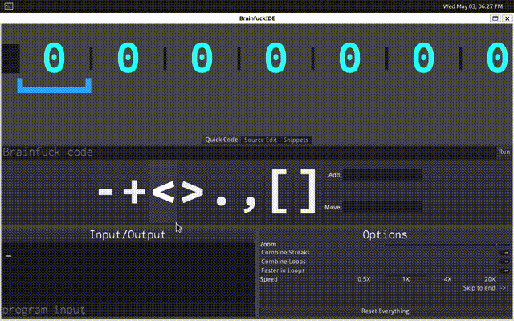

# Graphical Brainfuck IDE
_An intuitive, featureful and visually appealing [Brainfuck](https://en.wikipedia.org/wiki/Brainfuck) IDE/debugger built in [Godot](https://godotengine.org/)_

__Standalone builds__ for Linux, Windows and Mac available [here](https://github.com/william01110111/BrainfuckIDE_builds).

## About
[Brainfuck](https://en.wikipedia.org/wiki/Brainfuck) is a relatively well known [esoteric programming language](https://en.wikipedia.org/wiki/Esoteric_programming_language) made up of only 8 single-character commands (`+`, `-`, `>`, `<`, `,`, `.`, `[` and `]`). While there are numerous Brainfuck interpreters and compilers, this project aims to make Brainfuck simple, easy and fun.

## Features
* REPL-like behavior
* Variety of input methods
* Useful sample code
* Animated real-time data tape with adjustable zoom
* IO panel
* Speed-of-execution controls
* Optional 8bit mode

## Contributing
Pull requests welcome! All you need to do to get started is clone this repo and download the [Godot game engine](https://downloads.tuxfamily.org/godotengine/2.1.5/) (NOTE: you currently need Godot 2. For porting to godot 3 see [#4](https://github.com/wmww/BrainfuckIDE/issues/4)). If you haven't used it before, Godot has integrated code and UI editors, and its scripting language, GDScript, is quite similar to Python (Don't listen to GitHub, this is *NOT* a C++ project). Any of the [help wanted issues](https://github.com/wmww/BrainfuckIDE/labels/help%20wanted) would be great to start out on.

## Screenshots

